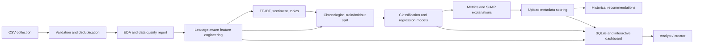

# YouTube Trend Intelligence

An end-to-end analytics workspace for cleaning historical YouTube trending data, exploring performance patterns, training time-aware models, explaining model behavior, and estimating the potential performance of a planned upload.

The app is built with Python, Pandas, NumPy, scikit-learn, optional XGBoost, TF-IDF/NMF, optional SHAP, SQLite, Plotly, and Streamlit. The existing React page is retained as a separate visual prototype; the data-backed application is `app.py`.

## Dataset

Place `INvideos.csv` in the project root. The supplied file contains 50,000 rows and fields for title, channel, category, publication time, views, likes, dislikes, comments, description/tags, trending status, and trend duration. The cleaning workflow found no duplicate IDs, invalid dates, blank titles, or missing values in this supplied sample; the pipeline still handles those cases for replacement uploads.

`category_metadata.json` maps YouTube category IDs to canonical names. Edit this mapping if the data comes from a different category taxonomy. Country or location filters and maps are enabled only if the source CSV contains a `country` column; the supplied `INvideos.csv` does not, so the app explicitly marks geographic analysis unavailable rather than inferring locations.

## Run Locally

Windows PowerShell:

```powershell
py -3.12 -m venv .venv
.\.venv\Scripts\Activate.ps1
python -m pip install --upgrade pip
python -m pip install -r requirements.txt
streamlit run app.py
```

Python 3.11–3.13 is recommended for broad binary-wheel compatibility across XGBoost, SHAP, and scientific packages. If a native dependency is unavailable on the selected Python version, install with a supported version or use `--no-xgboost` with the training script. The project-local `.venv` is the runtime environment.

The app is available at `http://localhost:8501`. Use the sidebar dataset path or upload a CSV with compatible columns. The supplied CSV is selected by default.

## Project Structure

```text
app.py                         Streamlit dashboard and page routing
INvideos.csv                   Historical source dataset
category_metadata.json         Category ID lookup
requirements.txt               Python dependencies
youtube_analytics/
  config.py                    Paths, logging, artifact configuration
  data.py                      Cleaning, feature engineering, text analysis
  database.py                  SQLite persistence and prediction history
  modeling.py                  Time-aware model training, inference, SHAP
scripts/
  prepare_data.py              ETL and SQLite command-line workflow
  train_models.py              Model training and metrics export
sql/queries.sql                Example SQLite analytics queries
artifacts/                     Generated database, logs, and model artifacts
src/                           Existing React dashboard prototype
```

## Data Workflow



## Dashboard Pages

- Overview: KPIs, trend timelines, category mix, channel reach, automated insights, JSON report download, and data-quality summary.
- Trend Analytics: persistence, outliers, publication heatmap, funnel, Spearman correlation matrix, and 3D feature-space explorer.
- ML Predictions: model training/comparison and upload-metadata estimates for trend probability, views, engagement, and duration.
- NLP Analysis: TF-IDF keywords, NMF topics, title sentiment, and title-length distribution.
- Channel Analysis and Category Analysis: ranking, trend/engagement comparisons, treemaps, scatter plots, and radar summaries.
- Engagement Metrics and View Forecast: view/engagement comparisons, distributions, chronological holdout, and aggregate daily forecast.
- Recommendation Engine: category/title/time suggestions from observed historical patterns and the upload scorer.
- Model Explainability: SHAP global feature contributions where supported, with model feature importance fallback.
- Data Explorer: search, sort, anomaly review, CSV export, and geographic analysis when country data exists.

The shared slicer panel includes publication date, searchable multi-select category/channel/country, video type, engagement level, views/likes/comments/engagement ranges, trending status, and (after training) predicted trend status. Select All, Clear All, Reset Filters, selected-filter chips, and live record counts are synchronized across pages. Country appears only when present in the source data. The model trainer intentionally uses the complete chronological dataset rather than outcome-filtered records, so slicers do not bias the training or holdout sample; model results and upload estimates are scoped to the current selection.

## ETL and SQL

Persist cleaned records and indexes to SQLite:

```powershell
python scripts/prepare_data.py
python scripts/prepare_data.py --cleaned-csv artifacts/cleaned_videos.csv
```

The default database is `artifacts/youtube_analytics.sqlite`. It stores the cleaned `videos` table, model metrics, and upload prediction history. Example analysis queries are in `sql/queries.sql`.

## Train Models

Use the dashboard's **Train / refresh model suite** button, or train from the command line:

```powershell
python scripts/train_models.py --metrics-csv artifacts/model_metrics.csv
```

To skip XGBoost:

```powershell
python scripts/train_models.py --no-xgboost
```

Classification compares Logistic Regression, Random Forest, and optionally XGBoost using accuracy, precision, recall, F1, and ROC-AUC. Regression compares Random Forest and optionally XGBoost for views, engagement, and trend duration using MAE, RMSE, and R². The split is chronological (first 80% for training, latest 20% for holdout). View regression uses a log target and reverses that transform for view estimates. The model bundle is serialized to `artifacts/youtube_models.joblib`.

Inference features are limited to upload-time metadata and prior channel/category history: title, description-derived counts/sentiment, tags, category, planned publication time, duration, thumbnail score, and historical priors. Future views, likes, and comments are not model inputs. Prediction outputs are historical-pattern estimates, not guarantees.

## Methods and Limits

- Text features use scikit-learn TF-IDF and NMF. Sentiment is a lightweight transparent word-list baseline, not a pretrained transformer model.
- SHAP is attempted for supported tree models; model feature importance is used as a fallback.
- Geographic analysis requires a `country` column. `INvideos.csv` has no country field.
- `views` is the source dataset's observed video view count. It is not necessarily a seven-day target unless the input data is a seven-day snapshot.
- Recommendation patterns are observational associations, not causal effects. Test publishing suggestions against your own channel data.
- The dashboard caps some scatter/NLP samples and table display rows for responsiveness; downloads respect the active filters.